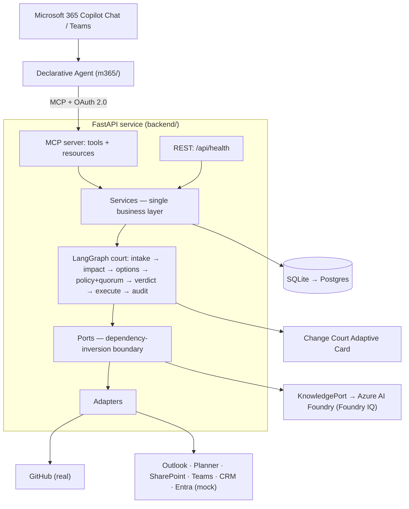

# AI Change Court


**Governed execution for risky enterprise decisions in Microsoft Teams.**

Decisions happen in chat faster than governance can keep up — "delay the launch a week", "promise
this customer the feature by Friday", "give this vendor access until the campaign is done." Each one
quietly mutates GitHub, calendars, CRM, SharePoint, support, and compliance. AI Change Court puts a
risky decision **on trial** before it becomes action: it detects who and what the decision affects,
simulates the consequences, decides which stakeholders must sign off, collects a verdict, and only
then executes across systems — leaving an auditable trail.

It is not a chatbot and not a workflow macro. It decides **whether a decision is even safe to
execute**, and when it isn't, it says so and proposes a safer path.

## The trial

Every request runs through a single, inspectable "court" pipeline:

```
intake → impact → options → policy + quorum → [verdict] → execute → audit
```

1. **Intake** — parse the request into a structured change; every requested action is validated
   against a **capability registry**, so the agent cannot invent or perform unsupported actions.
2. **Impact** — gather the second-order consequences across systems (open blockers, customer
   commitments, renewal value, schedule conflicts) as evidence.
3. **Options** — produce a feasible execution plan; when the request is unsafe, produce a **safe
   alternative**.
4. **Policy + quorum** — risk-score the change (rules are data), decide which stakeholders must
   approve, and offer verdict options (approve · approve internal only · request revision · reject).
5. **Verdict** — the run **suspends to a durable checkpoint** and waits; a cast verdict resumes it.
6. **Execute** — approved steps run through pluggable adapters; a **dry-run** mode predicts effects
   without touching any external system.
7. **Audit** — every step records an append-only before/after snapshot with rollback hints.

The pipeline is presented as courtroom roles — Prosecutor (impact), Defender (options), Clerk
(audit), Executor (execution) — implemented today as one controllable agent.

## What it looks like

In Teams, a risky decision returns a **Change Court card**: the proposed change, the impact
evidence, the stakeholders required to approve, the predicted effects with rollback hints, and the
verdict buttons. Approving resumes the run and executes; the audit trail records the outcome.

## Three trials

- **Launch Slip Trial** — "slip the launch from June 10 to June 17." Updates a real GitHub milestone
  plus mock calendar, planner, and announcement; flagged HIGH risk; an unsupported request such as
  "delete the repo" is blocked by the capability registry; a simulated step failure surfaces a
  partial result with a rollback hint instead of crashing.
- **Customer Promise Trial** — "promise Customer A the SSO feature is GA by June 17." The court finds
  open blockers, the customer's renewal value, and a security review scheduled *after* the promised
  date, then **rejects the unsafe promise** and proposes a safe alternative (private preview on the
  17th, GA after the review), drafting the customer reply and an escalation thread.
- **Vendor Access Trial** — "give the vendor access until the campaign is done." The court flags the
  ambiguous duration and the over-broad scope, and proposes **least-privilege** access (read-only to
  one folder) with an **expiry and auto-revoke**, pending the right approvals.

## Architecture



The same shape in text:

```
Microsoft 365 Copilot Chat / Teams
  └─ Declarative Agent (m365/)              the chat entry point
        │  MCP + OAuth 2.0
        ▼
  FastAPI service (backend/)
     ├─ MCP server      tools + resources the chat agent calls (OAuth2-secured)
     ├─ REST API        minimal: health (audit/trial inspection is an MCP resource)
     ├─ Services        single business layer shared by MCP and REST
     ├─ Agent           LangGraph court: intake → impact → options → policy+quorum → [verdict] → execute → audit
     ├─ Ports           abstract interfaces (the dependency-inversion boundary)
     └─ Adapters        GitHub (real) + Outlook/Planner/SharePoint/Teams/CRM/Entra (mock)
  Knowledge grounding   KnowledgePort → Azure AI Foundry (Foundry IQ); offline fake locally
  SQLite (local) → Postgres (later)
```

Design highlights:

- **Durable verdict interrupt.** The run suspends to a checkpoint at the verdict gate and resumes
  when a verdict is cast, so nothing is held in memory across the wait.
- **Ports & adapters (SOLID).** Integrations sit behind one `IntegrationAdapter` interface exposing
  both **read** (evidence) and **write** (action) capabilities. GitHub is real; the rest are mocks
  returning realistic data, chosen by configuration, so the whole system runs locally with no
  external credentials.
- **One business layer.** The MCP tools and the minimal REST API both delegate to the same services
  — no duplicated logic. The Teams Adaptive Card is the primary surface.

## Tech stack

- **Entry point:** Microsoft 365 Copilot declarative agent + Adaptive Cards
- **Backend:** FastAPI (Python 3.11+)
- **Agent orchestration:** LangGraph
- **Integration protocol:** Model Context Protocol (MCP) with OAuth 2.0
- **Persistence:** SQLAlchemy + Alembic over SQLite (Postgres-ready)

## Repository layout

```
backend/    FastAPI app: agent/, mcp/, api/, services/, ports/, adapters/, domain/
m365/        declarative agent manifest, plugin manifest, Adaptive Card templates
docs/        architecture, ADRs, API/contract, trials & test data
scripts/     developer/demo scripts (verify.sh, seed data)
```

## Getting started (local)

> The project runs fully locally. No Microsoft 365 tenant is required for development; the chat
> entry point is wired separately once a tenant is available.

```bash
cd backend
uv sync
cp ../.env.example ../.env

uv run uvicorn app.main:app --reload    # REST health only (http://localhost:8000/api/health)
uv run uvicorn app.asgi:app --reload    # REST + the OAuth2-protected MCP server at /mcp
```

Run the demo and the verification gate (both credential-free, fully mocked):

```bash
make demo          # three trials end-to-end; opens on the Customer Promise refusal
scripts/verify.sh  # trials + safety + MCP + quality gates (tenant checks report PENDING)
make check         # ruff + mypy + pytest
```

**See the Change Court card without a tenant.** The Adaptive Card renders tenant-free two ways: run
the clickable [Playground bot](m365/playground-bot/) (`make bot` + the Microsoft 365 Agents
Playground), or `make cards` and open a file from
[`m365/adaptive-cards/generated/`](m365/adaptive-cards/generated) in the
[Adaptive Cards Designer](https://adaptivecards.io/designer).

## Configuration

Set via environment variables (see `.env.example`):

- `DB_URL` — defaults to a local SQLite file.
- `INTEGRATION_MODE` — per-system `real` or `mock` selection (default: GitHub `real`, others `mock`).
- `FORCE_ALL_MOCK=true` — run every integration as a mock, with zero external credentials.
- `DRY_RUN_DEFAULT` — whether new changes default to dry-run.
- `GITHUB_TOKEN` / `GITHUB_REPO` — required only when the GitHub adapter runs in `real` mode
  (point `GITHUB_REPO` at a throwaway `owner/name`).
- `OAUTH_*` — MCP OAuth2 settings; a local dev issuer is used when no tenant is configured.
- `PUBLIC_BASE_URL` — public HTTPS origin once the backend is deployed; the MCP resource URL is
  `{PUBLIC_BASE_URL}/mcp`. Left empty locally (defaults to `http://localhost:8000`).

**Never commit secrets.** Use environment variables or a secret store.

### Grounding the Customer Promise trial in real GitHub (opt-in)

The Customer Promise trial weighs open **blocking issues** as impact evidence. By default these come
from the mock adapter, so the trial runs credential-free. To ground them in a live repository
instead:

1. In a throwaway repo, open a few issues and label them `blocker` (the default label; override with
   the `label` read param). Pull requests are ignored — only issues count.
2. Run with the GitHub adapter in `real` mode:

   ```bash
   INTEGRATION_MODE=github:real GITHUB_TOKEN=<token> GITHUB_REPO=<owner/name> make demo
   ```

`FORCE_ALL_MOCK` stays the default elsewhere, so every other system remains mocked.

## Status

The court engine is implemented and runs end-to-end **locally and credential-free**: the three
trials pass (dry-run + verdict, with the reject-and-propose-a-safer-alternative behaviour), the
MCP tools/resources are exposed over an OAuth2-protected server, and `scripts/verify.sh` is green
apart from its *Pending tenant* section. The Change Court Adaptive Card renders and is clickable
**without a tenant** via the [Playground bot](m365/playground-bot/); the remaining tenant work is the
live Microsoft 365 Copilot / Teams sideload and real Microsoft Graph writes. See
[`roadmap.md`](./roadmap.md) for the phased plan and [`verify.md`](./verify.md) for verification.
