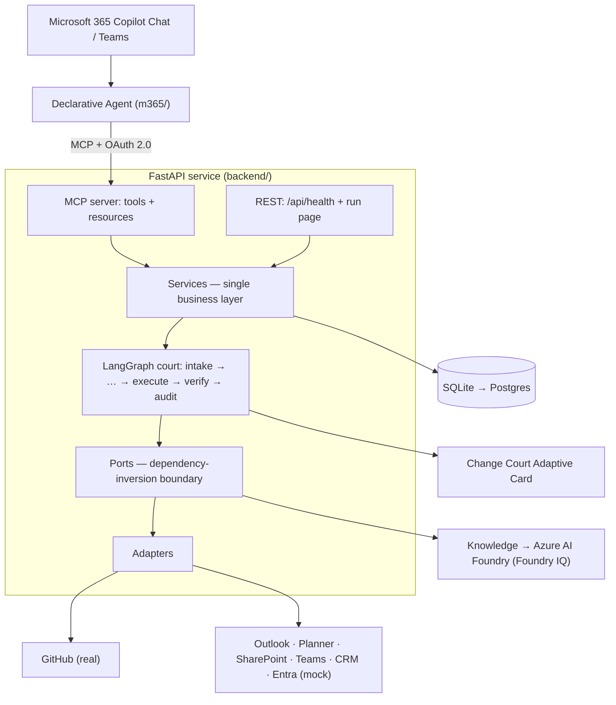

# AI Change Court


**Governed execution for risky enterprise decisions in Microsoft Teams.**

Cross-system changes get made in chat faster than anyone can keep them consistent — "move the
rehearsal a week out", "post the weekly status report". Each one touches GitHub, calendars, the task
planner, and Teams, and each is easy to half-do: one system updated, three left stale.

AI Change Court puts a change **on trial** before it becomes action. It gathers the cross-system
impact, decides who must sign off (no one, for routine work — the requester's own confirmation is
enough), collects a verdict, and only then executes — leaving an append-only audit trail. Crucially,
it can **refuse an unsafe decision and propose a safer alternative**. It is not a chatbot and not a
workflow macro.

## How it works

Every request runs through one inspectable "court" pipeline:

```
intake → impact → options → policy + quorum → [verdict] → execute → verify → audit
```

`intake` validates the request against a **capability registry** (so the agent can't invent
actions); `impact` gathers cross-system evidence; `options` produces a feasible plan *or* a safe
alternative; `policy` risk-scores it and derives the required approvers; the run then **suspends to a
durable checkpoint** at the verdict gate and resumes only when a verdict is cast; `execute` runs the
approved steps (or predicts them in **dry-run**); `audit` records an immutable before/after trail.

Diagrams: [`docs/architecture/`](docs/architecture/index.html) (layers · data flow · sequence ·
Azure/M365, offline HTML).

## Quick start — reproduce the demo

Runs **fully locally, credential-free** (every integration is mocked, dry-run by default). No
Microsoft 365 tenant required. Needs Python 3.11+ with [`uv`](https://docs.astral.sh/uv/).

```bash
cd backend
uv sync
cp ../.env.example ../.env

make demo          # run the Informed Approval scenario end to end
make check         # ruff + mypy + pytest
scripts/verify.sh  # trials + safety + MCP + quality gates (tenant checks report PENDING)
```

**See the Change Court card** without a tenant: run the clickable
[Playground bot](m365/playground-bot/) (`make bot` + the Microsoft 365 Agents Playground), or
`make cards` and open a file from [`m365/adaptive-cards/generated/`](m365/adaptive-cards/generated)
in the [Adaptive Cards Designer](https://adaptivecards.io/designer). Full walkthrough:
[`docs/demo/`](docs/demo/README.md).

To run the API locally:

```bash
uv run uvicorn app.main:app --reload    # REST health only  → http://localhost:8000/api/health
uv run uvicorn app.asgi:app --reload    # REST + the OAuth2-protected MCP server at /mcp
```

## Use it in your own environment

- **Real GitHub (opt-in).** Point the GitHub adapter at a throwaway repo containing a `Launch
  Rehearsal` milestone; everything else stays mocked:

  ```bash
  INTEGRATION_MODE=github:real GITHUB_TOKEN=<token> GITHUB_REPO=<owner/name> make demo
  ```

- **A new integration** is one adapter implementing `IntegrationAdapter` + one registration — the
  graph, services, REST, and MCP are untouched. **A new scenario** is one rule pack + gatherer +
  planner. See `backend/app/adapters/` and `backend/app/agent/`.

- **Go live in Microsoft 365.** Host the backend over public HTTPS (we use Azure Container Apps),
  configure Entra ID OAuth2, and sideload the declarative agent in [`m365/`](m365/). The platform
  references are in [`docs/README.md`](docs/README.md#microsoft-365--azure-service-reference).

## Architecture



- **Ports & adapters (SOLID).** The decision core depends only on ports; integrations sit behind one
  `IntegrationAdapter` interface, chosen real-vs-mock per system from config.
- **One business layer.** MCP tools and the minimal REST API both delegate to the same services — no
  duplicated logic. The Teams Adaptive Card is the only decision UI.
- **Durable verdict interrupt.** Nothing is held in memory across the approval wait; a repeated
  verdict can never double-execute.

## Tech stack

Microsoft 365 Copilot declarative agent + Adaptive Cards · FastAPI (Python 3.11+) · LangGraph ·
Model Context Protocol (MCP) over OAuth 2.0 · SQLAlchemy + Alembic (SQLite, Postgres-ready).

## Configuration

Set via environment variables (see [`.env.example`](.env.example)):

- `INTEGRATION_MODE` — per-system `real`/`mock` (default: GitHub `real`, others `mock`).
- `FORCE_ALL_MOCK=true` — run everything mocked, zero external credentials.
- `DRY_RUN_DEFAULT` — whether new changes default to dry-run.
- `DB_URL` — defaults to a local SQLite file.
- `GITHUB_TOKEN` / `GITHUB_REPO` — only when GitHub runs in `real` mode.
- `OAUTH_*` — MCP OAuth2 settings (a local dev issuer is used when no tenant is configured).

**Never commit secrets** — use environment variables or a secret store.

## Repository layout

```
backend/   FastAPI app: agent/ mcp/ api/ services/ ports/ adapters/ domain/
m365/      declarative agent manifest, plugin manifest, Adaptive Card templates
docs/      architecture diagrams, the demo, and ADRs
scripts/   developer/demo scripts (verify.sh, seed data)
```

## More

- **Architecture & decisions** → [`docs/`](docs/README.md)
- **Contributing** → [`CONTRIBUTING.md`](CONTRIBUTING.md)
