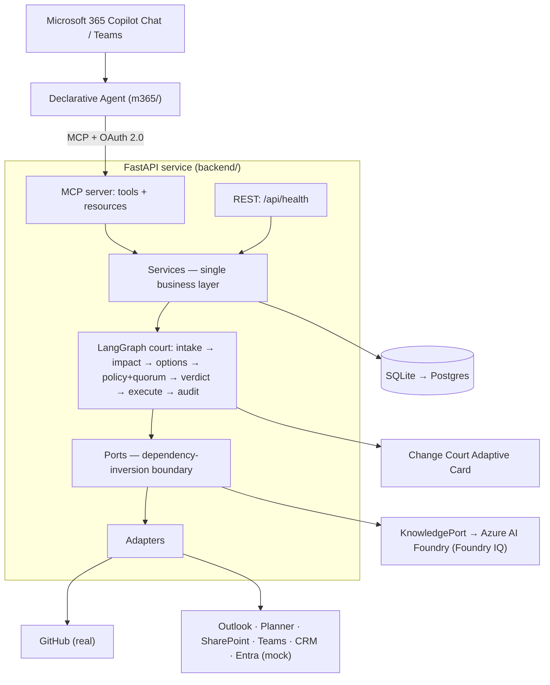

# AI Change Court


**Governed execution for risky enterprise decisions in Microsoft Teams.**

Cross-system changes happen in chat faster than anyone can keep them consistent — "move the
rehearsal a week out", "track what we agreed in standup", "post the weekly status report". Each one
touches GitHub, calendars, the task planner, and Teams, and each is easy to half-do: one system
updated, three left stale. AI Change Court puts the change **on trial** before it becomes action:
it detects who and what the change affects, simulates the consequences, decides which stakeholders
must sign off (none, for routine work — the requester's own confirmation suffices), collects a
verdict, and only then executes across systems — leaving an auditable trail.

It is not a chatbot and not a workflow macro. It decides **whether a decision is even safe to
execute**, and when it isn't, it says so and proposes a safer path.

## The trial

Every request runs through a single, inspectable "court" pipeline:

```
intake → impact → options → policy + quorum → [verdict] → execute → audit
```

1. **Intake** — parse the request into a structured change; every requested action is validated
   against a **capability registry**, so the agent cannot invent or perform unsupported actions.
2. **Impact** — gather the second-order consequences across systems (schedule conflicts, spoken
   follow-ups, scattered activity, open blockers, customer commitments) as evidence.
3. **Options** — produce a feasible execution plan; when the request is unsafe, produce a **safe
   alternative**.
4. **Policy + quorum** — risk-score the change (rules are data), decide which stakeholders must
   approve, and offer verdict options (approve · approve internal only · request revision · reject).
5. **Verdict** — the run **suspends to a durable checkpoint** and waits; a cast verdict resumes it.
6. **Execute** — approved steps run through pluggable adapters; a **dry-run** mode predicts effects
   without touching any external system.
7. **Audit** — every step records an append-only before/after snapshot with rollback hints.

The pipeline is presented as courtroom roles — Prosecutor (impact), Defender (options), Clerk
(audit), Executor (execution) — implemented as one controllable agent. With a real LLM configured
the roles reason for themselves: the Prosecutor selects additional evidence reads from the
capability catalog (validated and bounded), the Defender drafts the plan within the court's
refusal, both cite precedents from past rulings, and a verification step checks live writes
against the reviewed plan. Offline, every role falls back to its deterministic implementation, so
the trials stay reproducible. Risk scoring, quorum, and refusal authority are always
deterministic — the agent's freedom lives in perception and generation, never in the safety
verdict (see `docs/reference/adr/0009`).

## What it looks like

In Teams, a risky decision returns a **Change Court card**: the proposed change, the impact
evidence, the stakeholders required to approve, the predicted effects with rollback hints, and the
verdict buttons. Approving resumes the run and executes; the audit trail records the outcome.

The card also links to a **pipeline run page** — a read-only, CI-style run log (signed per-trial
links) where the whole flow can be watched live: each stage's timing and evidence, the verdict gate
filling its quorum, per-system execution lanes with before→after effects, and the audit record.
Decisions stay on the card; the page only inspects.

## Three trials

- **Reschedule Sync** — "move the rehearsal to June 17." One request moves a real GitHub milestone
  plus the calendar, planner tasks, and the Teams announcement together; flagged HIGH risk with an
  `eng_lead` + `comms` quorum. When the requested day **collides with an existing event** ("move the
  rehearsal to June 16"), the court **refuses the date as posed** and proposes the next free day —
  the same ripple, a safer date. An unsupported request such as "delete the repo" is blocked by the
  capability registry; a simulated step failure surfaces a partial result with a rollback hint.
- **Meeting Actions** — "create action items from standup." The court reads the discussion's spoken
  follow-ups and turns each dated one into a tracked task with its owner, scheduling the review that
  was proposed without a date. LOW risk, no approver — the requester's confirmation executes it.
- **Weekly Report** — "post the Project X weekly report." Recently closed GitHub issues, tracked
  tasks, and the week's meetings are collected once, composed into one message, and posted to the
  project channel. With the real GitHub adapter the evidence is the repository's actual activity.

The earlier governance trials — the unsafe customer promise (refusal + private-preview alternative)
and over-broad vendor access (least-privilege + auto-revoke) — remain wired and tested as additional
court capabilities (see [`docs/reference/trials.md`](docs/reference/trials.md)).

## Architecture



Design highlights:

- **Durable verdict interrupt.** The run suspends to a checkpoint at the verdict gate and resumes
  when a verdict is cast, so nothing is held in memory across the wait.
- **Ports & adapters (SOLID).** Integrations sit behind one `IntegrationAdapter` interface exposing
  both **read** (evidence) and **write** (action) capabilities. GitHub is real; the rest are mocks
  returning realistic data, chosen by configuration, so the whole system runs locally with no
  external credentials.
- **One business layer.** The MCP tools and the minimal REST API both delegate to the same services
  — no duplicated logic. The Teams Adaptive Card is the primary surface.

## Tech stack

- **Entry point:** Microsoft 365 Copilot declarative agent + Adaptive Cards
- **Backend:** FastAPI (Python 3.11+)
- **Agent orchestration:** LangGraph
- **Integration protocol:** Model Context Protocol (MCP) with OAuth 2.0
- **Persistence:** SQLAlchemy + Alembic over SQLite (Postgres-ready)

## Repository layout

```
backend/    FastAPI app: agent/, mcp/, api/, services/, ports/, adapters/, domain/
m365/        declarative agent manifest, plugin manifest, Adaptive Card templates
docs/        architecture, ADRs, API/contract, trials & test data
scripts/     developer/demo scripts (verify.sh, seed data)
```

A visual tour of every layer is in [`docs/architecture/index.html`](docs/architecture/index.html) — six
self-contained diagram pages that open offline; the security posture and credential-rotation runbook
are in [`docs/deploy/security.md`](docs/deploy/security.md).

## Getting started (local)

> The project runs fully locally. No Microsoft 365 tenant is required for development; the chat
> entry point is wired separately once a tenant is available.

```bash
cd backend
uv sync
cp ../.env.example ../.env

uv run uvicorn app.main:app --reload    # REST health only (http://localhost:8000/api/health)
uv run uvicorn app.asgi:app --reload    # REST + the OAuth2-protected MCP server at /mcp
```

Run the demo and the verification gate (both credential-free, fully mocked):

```bash
make demo          # the trials end-to-end; opens on the conflicting-date refusal
scripts/verify.sh  # trials + safety + MCP + quality gates (tenant checks report PENDING)
make check         # ruff + mypy + pytest
```

**See the Change Court card without a tenant.** The Adaptive Card renders tenant-free two ways: run
the clickable [Playground bot](m365/playground-bot/) (`make bot` + the Microsoft 365 Agents
Playground), or `make cards` and open a file from
[`m365/adaptive-cards/generated/`](m365/adaptive-cards/generated) in the
[Adaptive Cards Designer](https://adaptivecards.io/designer). The full demo guide — every screen,
the two-user approval flow, and the live demo-day checklist — is in [`docs/demo/`](docs/demo/).

## Configuration

Set via environment variables (see `.env.example`):

- `DB_URL` — defaults to a local SQLite file.
- `INTEGRATION_MODE` — per-system `real` or `mock` selection (default: GitHub `real`, others `mock`).
- `FORCE_ALL_MOCK=true` — run every integration as a mock, with zero external credentials.
- `DRY_RUN_DEFAULT` — whether new changes default to dry-run.
- `GITHUB_TOKEN` / `GITHUB_REPO` — required only when the GitHub adapter runs in `real` mode
  (point `GITHUB_REPO` at a throwaway `owner/name`).
- `OAUTH_*` — MCP OAuth2 settings; a local dev issuer is used when no tenant is configured.
- `PUBLIC_BASE_URL` — public HTTPS origin once the backend is deployed; the MCP resource URL is
  `{PUBLIC_BASE_URL}/mcp`. Left empty locally (defaults to `http://localhost:8000`).

**Never commit secrets.** Use environment variables or a secret store.

### Grounding the trials in real GitHub (opt-in)

Two trials read or write a live repository when the GitHub adapter runs in `real` mode; by default
both use the mock adapter, so everything runs credential-free.

1. **Reschedule Sync** updates a milestone titled `Launch Rehearsal` — create one in a throwaway
   repo (any due date; the trial moves it). **Weekly Report** aggregates the repo's recently closed
   issues — any active repository provides those naturally.
2. Run with the GitHub adapter in `real` mode:

   ```bash
   INTEGRATION_MODE=github:real GITHUB_TOKEN=<token> GITHUB_REPO=<owner/name> make demo
   ```

`FORCE_ALL_MOCK` stays the default elsewhere, so every other system remains mocked.

## Status

The court engine is implemented and runs end-to-end **locally and credential-free**: the three
trials pass (dry-run + verdict, with the reject-and-propose-a-safer-alternative behaviour), the
MCP tools/resources are exposed over an OAuth2-protected server, and `scripts/verify.sh` is green
apart from its *Pending tenant* section. The Change Court Adaptive Card renders and is clickable
**without a tenant** via the [Playground bot](m365/playground-bot/); the remaining tenant work is the
live Microsoft 365 Copilot / Teams sideload and real Microsoft Graph writes. See
[`roadmap.md`](./roadmap.md) for the phased plan and [`verify.md`](./verify.md) for verification.
